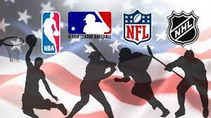

```{r setup, include = FALSE}
# Set code chunk defaults 
# Consider adding `message = FALSE` option
knitr::opts_chunk$set(echo = FALSE) 
                      
# Set R environment options
options(knitr.kable.NA = '')

# Load packages
library(tidyverse)
library(shiny)
library(leaflet)
library(dplyr)
```

```{r}
#| out.width: 120%
#| fig.align: center

```

# Intro

Professional sports economics is a controversial topic with a variety of factors that influence team performance, financial success, and overall competitiveness within leagues. There have been many discussions throughout the years in which people argue that sports teams should be owned by the cities in which they reside instead of being privately owned in an attempt to make them more accessible to the general public, along with the viewpoint that professional athletes are being paid too handsomely. Generally, people want to know if there is a correlation between spending and team success. While one would think that if a team spends more on resources and players they will win more, we think that there are many cases involving some of the notable franchises throughout history that have shown us that this isn’t always true. Additionally, there is also a prevailing narrative that the dominance of "big-market teams" in major cities like Los Angeles and New York is often attributed to their larger fan bases, extensive media markets, and lucrative sponsorship opportunities. Similarly to the case of spending, we also think that being located in a major city and having a massive fanbase doesn’t always translate to on-field victories. Hence, in our blog project we seek to expose these prevailing notions regarding team value, payroll, and winning percentages. The underlying questions to our investigations are: To what extent do teams' locations influence their value, payroll expenditures, and on-field success? Is there truly a relationship between spending more and winning more? How does this change between sports? These questions ultimately serve as the backbone of this continuous discussion that newscasters, franchise owners, fans, and even players have on a daily basis.
This project serves as an extension to our previous shiny project which initially explored annual revenue among major sports leagues across the entire world, not just the United States. In this project, we also decided to include the highest paid player across each league for each year. Interestingly enough, we found that, generally, the league with the highest revenue also had the highest paid player among the leagues. Therefore, this led us to want to explore this question further, but we wanted to narrow it down to see if a team's performance could be dependent on how much they spend, their valuations, and their geographical location. Unlike the shiny project, we did not have an international scope for this project, rather we focused just on teams in the United States across the NFL, MLB, NBA and NHL as these are the most popular sports leagues in the country. 


# Data/Procedure

All the data used in this project was found on the internet. We created data sets that included team valuation, payroll, win percent, and stadium location (longitude and latitude) for each team in each league. We cleaned this data by changing variable names and correcting old stadium locations. We then merged these data sets into a primary dataset that included the variables for all the teams in all the leagues.

For the visualization and analytical part of our project, we adopted a multi-faceted approach. We first used a bar chart to illustrate the teams with the highest payrolls, offering insights into the financial stature of the teams. Subsequently, we created two scatterplots: one comparing win percentage with team valuation and another juxtaposing team valuation against payroll. These visualizations aimed to explore potential correlations between a team's financial resources and their performance. Lastly, we developed an interactive map pinpointing each team's location, enriched with related data, thereby providing a spatial dimension to our analysis. This comprehensive approach allowed us to draw nuanced insights into the dynamics of team performance and valuation across leagues.


# Results

## Team Value

When we visualize the team valuation data across the four major sports leagues, we find a noteworthy observation that stems from an analysis of the 25 teams with the highest valuation. Our bar chart (Figure 1, below), which has “Teams” on the x-axis “Total Valuation” on the y-axis, we see that a staggering 18 out of the top 25 are affiliated with the National Football League (NFL). This statistic emphasizes the NFL's popularity, and we can conclude that it is the most watched sports league in the country. For those seven non-NFL teams that are in the top 25 highest valued, we would expect that they have had a lot of success. Our rationale for this assumption is that in their elevated valuations not only within their respective leagues but also across all of the sports teams in the United States. We assumed that this financial standing positions them as economic powerhouses, suggesting that their prowess extends beyond the realms of revenue generation to potentially encompass on-field triumphs and enduring success in their respective sports. 


```{r}
scatter_data <- read.csv("wrangled_data.csv")

bar_data_value <- scatter_data |>
  arrange(desc(value)) |>
  head(25)

ggplot(bar_data_value, aes(x = reorder(team, -value), y = value, fill = league)) +
  geom_col() +
  theme_minimal() +
  theme(axis.text.x = element_text(angle = 45, hjust = 1))  + # Rotate x-axis labels for better readability
  labs(
    title = "25 Teams with the Highest Valuation",
    x = "Team",
    y = "Total Valuation ($)",
    fill = "League",
    caption = "Figure 1"
  ) 
```

## Team Payroll

We then dove into the payroll commitments that teams make to their players. Utilizing another bar chart to examine the top 25 teams (x-axis) with the highest payrolls (y-axis), we identified that 10 of these teams also appeared on the list of the 25 teams with the highest valuation. This observation, however, seemed less significant, indicating that less than half of the teams valued the highest don't always allocate a proportionate share of their finances to player salaries. Of course, our inquiry only examines team spending over the most recent season. Nonetheless, we also found similar trends in the payroll graph to the valuation: 18 out of the 25 highest payroll teams hailed from the NFL, while the remaining 7 belonged to the MLB. This ultimately, suggests that the NFL, in particular, places substantial emphasis on player salaries compared to other leagues. 

```{r}
bar_data_payroll <- scatter_data |>
  arrange(desc(payroll)) |>
  head(25)

ggplot(bar_data_payroll, aes(x = reorder(team, -payroll), y = payroll, fill = league)) +
  geom_col() +
  theme_minimal() +
  theme(axis.text.x = element_text(angle = 45, hjust = 1))  + # Rotate x-axis labels for better readability
  labs(
    title = "30 Teams with the Highest Payroll",
    x = "Team",
    y = "Payroll ($)",
    fill = "League"
  ) 

```


## Relationship between Payroll and Winning Percentage

In our analysis of winning percentage and payroll, we found there tends to be a positive relationship between how much players are paid and the teams’ success across all four leagues in the United States. We put together scatter plots for each league with the team’s  “Player Payroll” on the x-axis and the team’s “Winning Percentage” on the y-axis. This positive correlation suggests that a considerable investment in player salaries aligns with more success in professional sports in the United States. More success also generally leads to more ticket sales and investment in the franchise, which likely results in a higher valuation for the franchise. A higher payroll also signals that these teams have some of the best players in their respective leagues, as star players always charge more. These findings provide valuable insights into the intricate dynamics between financial investment in player talent and the competitive performance of sports teams, which ultimately go to show that, in most cases, teams that have more success are paying their players more, and also suggests that they have some of the most highly sought-after players in their league. 


#scatterplot
```{r}

mlb_data <- scatter_data |>
  filter(league == "MLB")

nba_data <- scatter_data |>
  filter(league == "NBA")

nfl_data <- scatter_data |>
  filter(league == "NFL")

nhl_data <- scatter_data |>
  filter(league == "NHL")

ggplot(data = mlb_data, aes(x = payroll, y = win_percentage)) +
  geom_point() +
  geom_smooth(method = "lm", se = FALSE) +
  labs(
    title = "MLB: The Relationship Between Payroll and Winning Percentage",
    x = "Player Payroll ($)",
    y = "2023 Win Percentage"
  )

ggplot(data = nfl_data, aes(x = payroll, y = win_percentage)) +
  geom_point() +
  geom_smooth(method = "lm", se = FALSE) +
  labs(
    title = "NFL: The Relationship Between Payroll and Winning Percentage",
    x = "Player Payroll ($)",
    y = "2022-23 Win Percentage"
  )

ggplot(data = nba_data, aes(x = payroll, y = win_percentage)) +
  geom_point() +
  geom_smooth(method = "lm", se = FALSE) +
  labs(
    title = "NBA: The Relationship Between Payroll and Winning Percentage",
    x = "Player Payroll ($)",
    y = "2022-23 Win Percentage"
  )

ggplot(data = nhl_data, aes(x = payroll, y = win_percentage)) +
  geom_point() +
  geom_smooth(method = "lm", se = FALSE) +
  labs(
    title = "NHL: The Relationship Between Payroll and Winning Percentage",
    x = "Player Payroll ($)",
    y = "2022-23 Win Percentage"
  )

ggplot(data = scatter_data, aes(x = payroll, y = win_percentage, color = league)) +
  geom_point() +
  geom_smooth(method = "lm", se = FALSE) +
  labs(
    title = "The Relationship Between Payroll and Winning Percentage by League",
    x = "Player Payroll ($)",
    y = "2022-23 Win Percentage"
  ) 
```


## Relationship Between Value and Payroll
	
Lastly, we found that, across the major professional sports leagues in the United States, there is another discernable positive correlation between a team's valuation and the investments made in player salaries. After creating a scatter plot with “Valuation” on the x-axis and “Payroll” on the y-axis and including the teams from each league, we found a consistent pattern where teams with higher valuations tended to allocate more compensation towards their players. This was most evident when comparing the NHL and the NFL, as they have the largest discrepancies between valuation and payroll. NHL franchises have, on average, lower valuations than any other league franchises in the United States. The opposite is true for the NFL as football teams tend to have higher valuations than any other league franchises. To no one's surprise, we see that the payroll for players that play for NFL teams tend to be higher than players who play different sports.

Conversely, the HL players tend to make less than professional athletes who play in the MLB, NBA, and NFL.  One interesting point that we took away from the scatter plot is that a decent amount of MLB teams pay their players more than the athletes in the NBA, even though the valuation of those MLB teams tends to be lower than the valuation of the NBA teams. This fact reveals that MLB teams may pay their players a disproportionate amount of money concerning the overall valuation of the franchise.
 
```{r}
bar_in_both <- inner_join(bar_data_value, bar_data_payroll, by = "team")

correlation_val <- cor(scatter_data$value, scatter_data$payroll)

ggplot(scatter_data, aes(x = value, y = payroll, color = league)) +
  geom_point() +
  theme_minimal() +
  geom_text(
    x = 1700000000,
    y = 320000000,
    label = paste("r=", round(correlation_val, 3)),
    show.legend = FALSE,
    color = "black"
  ) +
  labs(
    title = "Relationship between Value and Payroll",
    subtitle = "Data from 2022-23 Seasons",
    x = "Team Valuation ($USD)",
    y = "Payroll ($USD)",
    color = "League"
  )
```


## Interactive Map

```{r}
library(shiny)
library(leaflet)
library(dplyr)

ui <- fluidPage(
  titlePanel("Sports Team Analysis"),
  selectInput("league", "Choose a League:", choices = c("NFL", "NHL", "NBA", "MLB")),
  selectInput("variable", "Select Variable:", choices = c("payroll", "win_percentage", "value")),
  leafletOutput("map")
)

server <- function(input, output) {
  
  data <- read.csv("wrangled_data.csv")
  
  filteredData <- reactive({
    data %>% filter(league == input$league)
  })
  
  output$map <- renderLeaflet({
    leaflet(filteredData()) %>%
      addTiles() %>%
      addCircleMarkers(
        lng = ~longitude, lat = ~latitude,
        radius = ~scales::rescale(get(input$variable), to = c(5, 15)),
        popup = ~paste(team, "<br>", input$variable, ": ", get(input$variable))
      )
  })
}

shinyApp(ui = ui, server = server)
```


# References

All data sources, any key R packages, and any other sources used in developing your blog should be cited in full in a list of references at the end of your blog. Your blog post should also link to these sources as they are discussed. You may choose any reference style as long as sources are fully cited (try to be consistent!).

Typically, references in R Markdown (and LaTeX) files are [incorporated with a BibTeX database](https://bookdown.org/yihui/rmarkdown-cookbook/bibliography.html) (a .bib file). You can try this approach or manually include either a numbered or alphabetized list. 

Columbia University has compiled some guidance on [how to cite data](https://guides.library.columbia.edu/datacitation). Some data sources will give you the citation information to copy and paste. Use the provided citations or citation styles in those cases.

You can list R package citations with the code `citation("packageName")` in the console and then copy (and reformat as needed) the relevant text, e.g.,
```{r}
citation("DT")
```

The following citations are based on the American Statistical Association citation style (not all of these references are used in this document).:


<!-- Textbook -->
Baumer, B. S., Kaplan, D. T., and Horton, N. J. (2021), *Modern Data Science with R* (2nd ed.), Boca Raton, FL: CRC Press.

<!-- Journal article -->
Broman, K. W. and Woo, K. H. (2018), "Data Organization in Spreadsheets," *The American Statistician*, 72:1, 2-10, doi: [10.1080/00031305.2017.1375989](https://doi.org/10.1080/00031305.2017.1375989)

<!-- Website -->
Columbia University Libraries (n.d.), "Data Citation," available at <https://guides.library.columbia.edu/datacitation>.

<!-- Journal article -->
McNamara, A. and Horton N. J. (2018) "Wrangling Categorical Data in R," *The American Statistician*, 72:1, 97-104, doi: [10.1080/00031305.2017.1356375](https://doi.org/10.1080/00031305.2017.1356375).

<!-- Dataset -->
Shah, Syed A. A. (October 2022), "Starbucks Drinks" (Version 1), *Kaggle*, available at <https://www.kaggle.com/datasets/syedasimalishah/starbucks-drinks>.

<!-- R package -->
Xie Y, Cheng J, Tan X (2022). "DT: A Wrapper of the JavaScript Library 'DataTables'," R package version 0.24, available at <https://CRAN.R-project.org/package=DT>.
  


 


